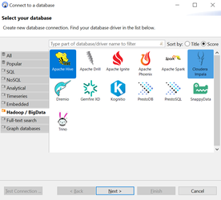
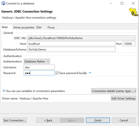
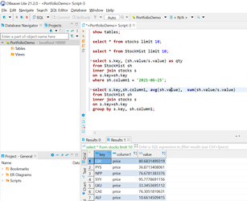
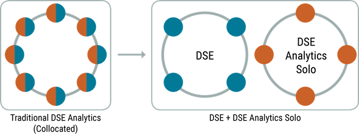

# Using DSE Analytics (Quick Start)

## Starting up the cluster

Use the start.sh script to start a cluster of 2 datacenters.

### Normal Start

```bash
sh start.sh
```

### Clean Start

```bash
sh start.sh fresh
```

Note: This will clean up all the saved data.

## Using DSE Studio

Click on below link to access the dse-studio

[DSE-Studio](http://localhost:9091/)

## Using Jupyter Notebook

Click on below link to access the jupyter notebook

[Jupyter](http://localhost:8888/)

## Using the spark shells

### Spark-sql

```bash
docker container exec -it analytics-seed dse spark-sql
```

### Spark-scala

```bash
docker container exec -it analytics-seed dse spark
```

### Spark-pysark

```bash
docker container exec -it analytics-seed dse pyspark
```

## Setting up spark sql on sql client like dbeaver

1. Install Dbeaver thru below link:
   [https://dbeaver.com/download/lite/](https://dbeaver.com/download/lite/)
2. Click on database on the menu bar and click on new database connection
3. Select **Apache Hive**

   
4. Click next and setup the JDBC parameters as show in below image

   
5. Now we are all set to start running HQL queries

   

**Note** : 10000 port should be exposed for the docker container and for username and password use “dse”

# Setup design



# Follow below links to learn spark

## Video Content

[Docs](./resources/docs/video_materials.md)

## Jupyter Notebook Exercises and docs

[Jupyter Notebook](http://localhost:8888/tree/notebooks)

[Docs for further reading](./resources/docs/further.md)
