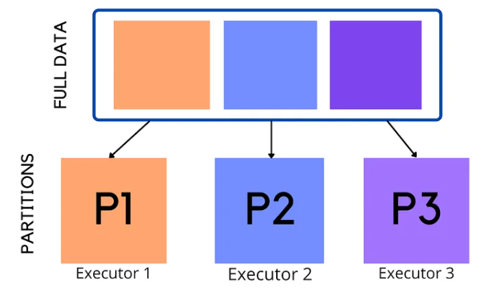

# Partitioning

Resilient Distributed Datasets are collection of various data items that are so huge in size, that they cannot fit into a single node and have to be partitioned across various nodes. Spark automatically partitions RDDs and distributes the partitions across different nodes.

Partitioning allows spark to execute transformations on multiple partitions in parallel which allows completing the job faster. You can also write partitioned data into a file system (multiple sub-directories) for faster reads by downstream systems.



### **Characteristics of Partitions in Apache Spark**

* Every machine in a spark cluster contains one or more partitions.
* The number of partitions in spark are configurable and having too few or too many partitions is not good.
* By default, it is set to the total number of cores on all the executor nodes.
* Data of each partition resides in a single machine and partitions in Spark do not span multiple machines.
* Spark/PySpark creates a task for each partition.Spark assigns one task per partition and each worker can process one task at a time.

### Spark Configuration

1. `spark.default.parallelism` : is the default number of partitions in `RDD`s returned by transformations like `join`, `reduceByKey`, and `parallelize` when not set explicitly by the user.configuration default value set to the number of cores on all nodes in a cluster, on local it is set to a number of cores on the system seems to only be working for raw `RDD` and is ignored when working with dataframes.

   If the task you are performing is not a join or aggregation and you are working with dataframes then setting these will not have any effect. You could, however, set the number of partitions yourself by calling `df.repartition(numOfPartitions)`
2. `spark.sql.shuffle.partitions` : configures the number of partitions that are used when shuffling data for joins or aggregations.configuration.

To change the settings in your code you can simply do:

```
sqlContext.setConf("spark.sql.shuffle.partitions", "300")
sqlContext.setConf("spark.default.parallelism", "300")
```

Alternatively, you can make the change when submitting the job to a cluster with `spark-submit`:

```
./bin/spark-submit --conf spark.sql.shuffle.partitions=300 --conf spark.default.parallelism=300
```

### **Types of Partitioning in Apache Spark**

1. **HashPartitioning** : Hash Partitioning attempts to spread the data evenly across various partitions based on the key. Object.hashCode method is used to determine the partition in Spark as partition = key.hashCode () % numPartitions.
2. **Range** : Range partitioning is an efficient partitioning technique. In range partitioning method, tuples having keys within the same range will appear on the same machine. Keys in a range partitioner are partitioned based on the set of sorted range of keys and ordering of keys.

### Mode of Partitioning in Apache Spark

Spark/PySpark supports partitioning in memory (RDD/DataFrame) and partitioning on the disk (File system).

1. **Partition in memory:** You can partition or repartition the DataFrame by calling `repartition()` or `coalesce()`transformations.

   ```bash
   newDF=df.repartition(10)
   ```

   ```bash
   rdd3 = rdd1.coalesce(4)
   ```
2. **Partition on disk:** While writing the PySpark DataFrame back to disk, you can choose how to partition the data based on columns by using `partitionBy()` of `pyspark.sql.DataFrameWriter`.

### Shuffling of data in spark

The Spark SQL shuffle is a mechanism for redistributing or re-partitioning data so that the data grouped differently across partitions, based on your data size you may need to reduce or increase the number of partitions of RDD/DataFrame using `spark.sql.shuffle.partitions` configuration or through code.

Spark shuffle is a very expensive operation as it moves the data between executors or even between worker nodes in a cluster so try to avoid it when possible. When you have a performance issue on Spark jobs, you should look at the Spark transformations that involve shuffling.

Spark shuffling triggers for transformation operations like:

1. **RDD** : `gropByKey()`, `reducebyKey()`, `join()`, `union()`, `groupBy()`
2. **DataFrames** : `join()`, `union()`, all aggregate functions

Spark Shuffle is an expensive operation since it involves the following

* Disk I/O
* Involves data serialization and deserialization
* Network I/O

### Choosing partitions

When using partitionBy(), you have to be very cautious with the number of partitions it creates, as having too many partitions creates too many sub-directories in a directory which brings unnecessarily and overhead to NameNode (if you are using Hadoop) since it must keep all metadata for the file system in memory.

Let’s assume you have a US census table that contains zip code, city, state, and other columns. Creating a partition on the state, splits the table into around 50 partitions, when searching for a zipcode within a state (state=’CA’ and zipCode =’92704′) results in faster as it needs to scan only in a **state=CA** partition directory.

Partition on zipcode may not be a good option as you might end up with too many partitions.

Another good example of partition is on the Date column. Ideally, you should partition on Year/Month but not on a date.